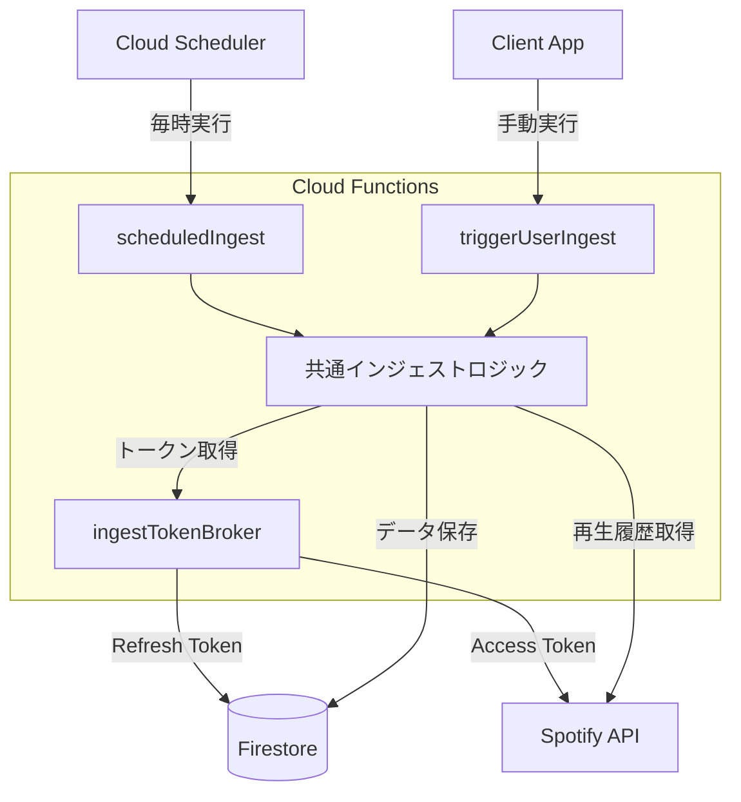

# Spotify History Ingest for Firebase

Spotify の「最近再生した曲 (Recently Played)」履歴を定期的に取得し、Firestore に永続化するための Cloud Functions システムです。
Spotify API の制限（直近50件まで）を超えて、長期間のリスニング履歴を蓄積することを目的としています。

## システム概要

本システムは **Firebase Cloud Functions** 上で動作し、以下のコンポーネントで構成されています。



## 主な機能

*   **完全自動化**: 1時間ごとに全ユーザーのデータを自動収集（Cloud Scheduler）。
*   **インクリメンタル取得**: 前回取得した日時（カーソル）以降のデータのみを取得し、APIコールを最小化。
*   **安全なトークン管理**: リフレッシュトークンは Firestore に保存し、内部 Token Broker 経由でアクセストークンを取得。
*   **堅牢なエラー処理**: `p-queue` による並列数制御と `p-retry` による再試行ロジックを実装。
*   **データ構造**: TTL (`expireAt`) 対応のデータ形式で Firestore に保存。

## 必要要件

*   Node.js 20以上
*   Firebase プロジェクト (Blazeプラン推奨)
*   Spotify Developer App (Client ID / Secret)

## セットアップ手順

### 1. プロジェクトの準備

```bash
# 依存関係のインストール
npm install

# Firebaseへのログイン
firebase login
```

### 2. 環境変数の設定

`functions/.env` ファイルを作成し、以下の変数を設定してください（`functions/.env.example` を参考にしてください）。

| 変数名 | 説明 |
|---|---|
| `TOKEN_BROKER_URL` | トークン発行関数のURL（デプロイ後に確定しますが、通常は `https://[region]-[project].cloudfunctions.net/ingestTokenBroker`） |
| `SPOTIFY_CLIENT_ID` | Spotify Developer Dashboard で取得した Client ID |
| `SPOTIFY_CLIENT_SECRET` | Spotify Developer Dashboard で取得した Client Secret |
| `DEFAULT_USER_CONCURRENCY` | 同時に処理するユーザー数（デフォルト: 5） |
| `SAFETY_WINDOW_MINUTES` | 取得漏れを防ぐための安全マージン（分）（デフォルト: 120） |

### 3. デプロイ

以下のコマンドでビルドとデプロイを一括実行します。

```bash
npm run deploy
```

> **Note**: デプロイ時に `.env` ファイルも自動的にアップロードされ、関数内で読み込まれます。

### 4. ユーザーデータの登録

インジェスト対象となるユーザーには、Firestore にリフレッシュトークンを設定する必要があります。

**パス**: `/users/{uid}/tokens/spotify`

```json
{
  "refresh_token": "YOUR_REFRESH_TOKEN"
}
```

## 利用可能な関数

| 関数名 | トリガー | 役割 |
|---|---|---|
| `scheduledIngest` | Cloud Scheduler (毎時) | 全ユーザーのインジェストを定期実行 |
| `triggerUserIngest` | HTTPS Callable | クライアントから特定のユーザーのインジェストを手動実行（要認証） |
| `ingestTokenBroker` | HTTPS Request | 内部利用: Firestoreのリフレッシュトークンをアクセストークンに変換 |

## 開発・テスト

### ローカルエミュレータ

ローカル環境で関数をテストするには以下を実行します。

```bash
npm run serve:functions
```

別のターミナルからシェルで関数を呼び出してテストできます。

```bash
firebase functions:shell
# 手動実行のテスト
> triggerUserIngest({ auth: { uid: 'test-user-uid' } })
```

### ディレクトリ構成

ソースコードは全て `functions/src` に集約されています。

*   `functions/src/index.ts`: エントリーポイント
*   `functions/src/jobs/`: インジェストのメインロジック
*   `functions/src/services/`: Spotify API / Firestore / Token 関連サービス
*   `functions/src/lib/`: ユーティリティ（ロガー、レートリミット）

## ライセンス

[MIT](LICENSE)
