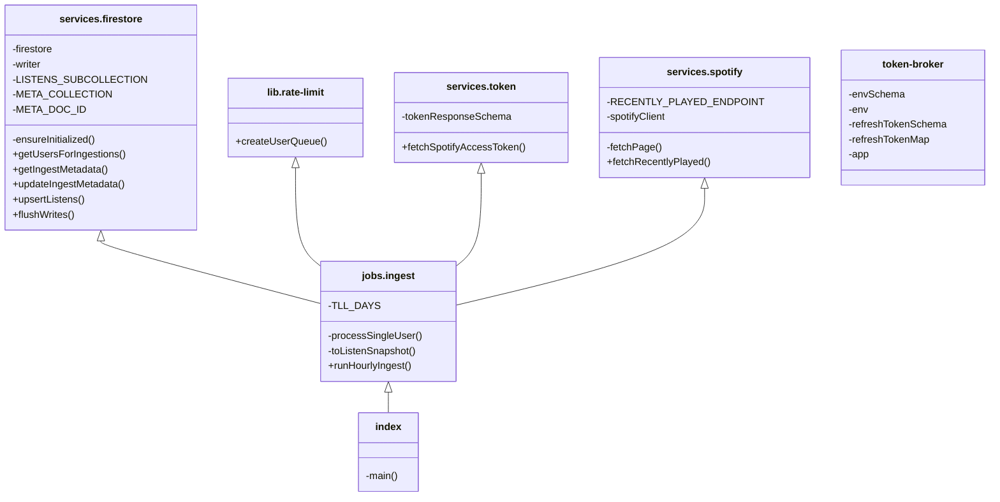

```mermaid
classDiagram
    class jobs.ingest{
        -TLL_DAYS
        -processSingleUser()
        -toListenSnapshot()
        +runHourlyIngest()
    }

    class lib.rate-limit{
        +createUserQueue()
    }

    class services.firestore{
        -firestore
        -writer
        -LISTENS_SUBCOLLECTION
        -META_COLLECTION
        -META_DOC_ID
        -ensureInitialized()
        +getUsersForIngestions()
        +getIngestMetadata()
        +updateIngestMetadata()
        +upsertListens()
        +flushWrites()
    }

    class services.spotify{
        -RECENTLY_PLAYED_ENDPOINT
        -spotifyClient
        -fetchPage()
        +fetchRecentlyPlayed()
    }

    class services.token{
        -tokenResponseSchema
        +fetchSpotifyAccessToken()
    }

    class index{
        -main()
    }

    class token-broker{
        -envSchema
        -env
        -refreshTokenSchema
        -refreshTokenMap
        -app
    }

    services.firestore <|-- jobs.ingest
    lib.rate-limit <|-- jobs.ingest
    services.token <|-- jobs.ingest
    services.spotify <|-- jobs.ingest

    jobs.ingest <|-- index

```