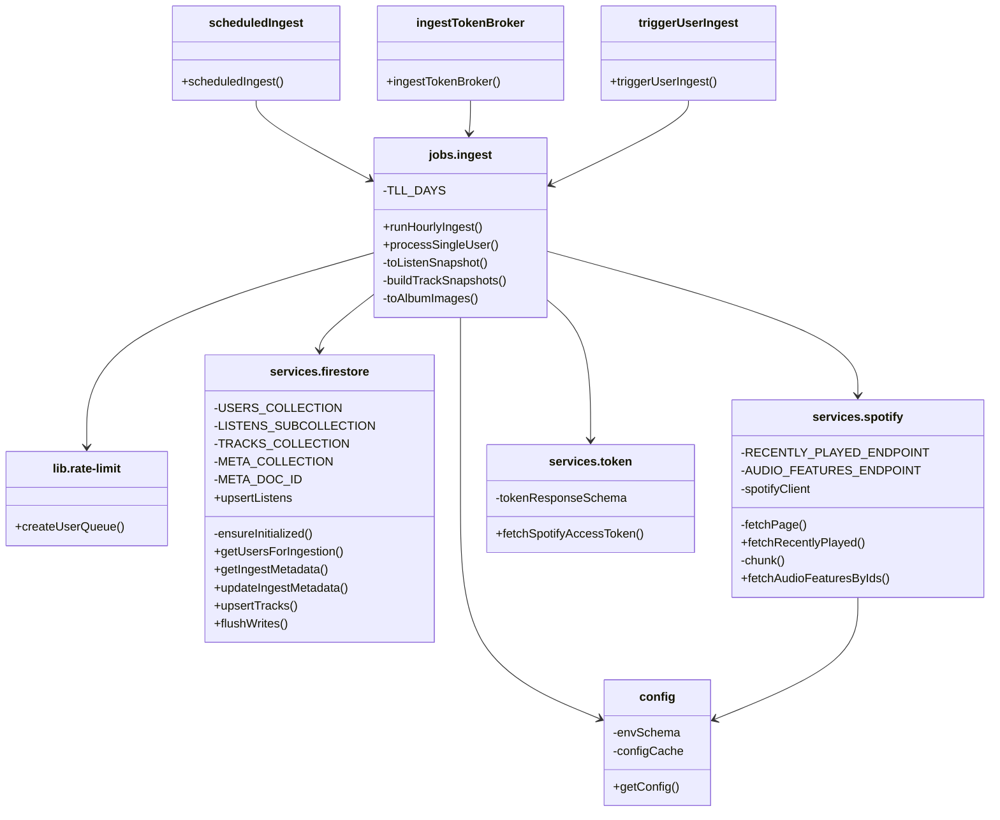

```mermaid
classDiagram
    class jobs.ingest{
        -TLL_DAYS
        +runHourlyIngest()
        +processSingleUser()
        -toListenSnapshot()
        -buildTrackSnapshots()
        -toAlbumImages()
    }
    class lib.rate-limit{
        +createUserQueue()
    }
    class services.firestore{
        -USERS_COLLECTION
        -LISTENS_SUBCOLLECTION
        -TRACKS_COLLECTION
        -META_COLLECTION
        -META_DOC_ID
        -ensureInitialized()
        +getUsersForIngestion()
        +getIngestMetadata()
        +updateIngestMetadata()
        +upsertListens
        +upsertTracks()
        +flushWrites()
    }
    class services.spotify{
        -RECENTLY_PLAYED_ENDPOINT
        -AUDIO_FEATURES_ENDPOINT
        -spotifyClient
        -fetchPage()
        +fetchRecentlyPlayed()
        -chunk()
        +fetchAudioFeaturesByIds()
    }
    class services.token{
        -tokenResponseSchema
        +fetchSpotifyAccessToken()
    }
    class config{
        -envSchema
        -configCache
        +getConfig()
    }
    class ingestTokenBroker{
        +ingestTokenBroker()
    }
    class scheduledIngest{
        +scheduledIngest()
    }
    class triggerUserIngest{
        +triggerUserIngest()
    }

    jobs.ingest --> config
    jobs.ingest --> lib.rate-limit
    jobs.ingest --> services.firestore
    jobs.ingest --> services.token
    jobs.ingest --> services.spotify
    services.spotify --> config
    scheduledIngest --> jobs.ingest
    ingestTokenBroker --> jobs.ingest
    triggerUserIngest --> jobs.ingest
```