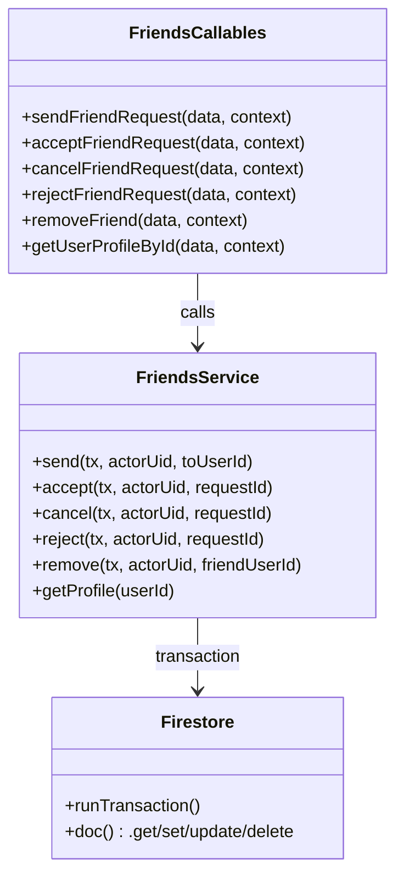
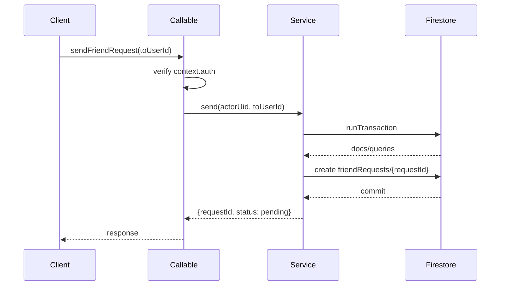

# 実装仕様書

## 1. 実装概要

### 1.1 問題の定義と背景
- 現行プロジェクトは Spotify ingest 用 Cloud Functions のみを提供しており、ソーシャル関係（友達申請/承認/解除）API が存在しない。
- 要求は「Firestore は公開読み取り」「更新は Cloud Functions 経由のみ」「認証済みユーザーのみ呼び出し可能」。
- 友達申請拒否は履歴を残さず削除し、`rejected` 状態は採用しない。

### 1.2 提案ソリューションの概要
- Firebase Callable Functions を6本追加し、友達関係の全更新をサーバー側で一元化する。
- すべての更新系処理は Firestore Transaction で実行し、重複申請や競合時の整合性を担保する。
- エラーは `HttpsError` + `details.code` にアプリコード（`not_found` など）を統一して返す。

### 1.3 機能要件
- 必須機能:
  - `sendFriendRequest`
  - `acceptFriendRequest`
  - `cancelFriendRequest`
  - `rejectFriendRequest`
  - `removeFriend`
  - `getUserProfileById`
- 非機能要件:
  - 認証必須（`context.auth.uid` を主体IDとして使用）
  - 書き込みは Cloud Functions 経由のみ
  - `friendRequests` は当事者のみ読み取り可能
  - `rejected` 状態は扱わない（reject時は削除）

## 2. 実装手順

| 順序 | 作業内容 | 詳細手順 | 確認方法 |
|------|----------|----------|----------|
| 1 | 基盤準備 | 友達機能の型・定数・エラーコード設計を追加 | `npm run lint` 成功 |
| 2 | Firestoreアクセス層 | friends/profile/request 用の read/write 関数を実装 | Emulator で読み書き確認 |
| 3 | Callable実装 | 6関数を実装し `index.ts` で export | `functions:shell` で実行確認 |
| 4 | セキュリティルール | `firestore.rules` 追加、`firebase.json` にルール設定追加 | Emulator Rules テスト通過 |
| 5 | 統合検証 | 正常系/異常系シナリオを通し検証 | 受け入れ条件全通過 |

## 3. ファイル構造

### 3.1 新規作成ファイル（予定）

```text
functions/src/
├── friends/
│   ├── callables.ts
│   ├── errors.ts
│   ├── schema.ts
│   └── service.ts
firestore.rules
firestore.indexes.json (必要時)
```

| ファイルパス | 目的 | 主要な責務 |
|-------------|------|------------|
| `functions/src/friends/callables.ts` | Callable エントリ | 入出力検証、認証、エラー変換 |
| `functions/src/friends/service.ts` | ドメインロジック | Transaction 内での状態遷移 |
| `functions/src/friends/errors.ts` | エラー定義 | app error code と HttpsError 変換 |
| `functions/src/friends/schema.ts` | 型/バリデーション | request/response 型、zod スキーマ |
| `firestore.rules` | アクセス制御 | 公開読取 + 書込禁止 + friendRequests当事者限定 |

### 3.2 変更対象ファイル

| ファイルパス | 変更内容 | 影響範囲 |
|-------------|----------|----------|
| `functions/src/index.ts` | 友達Callableの export 追加 | デプロイ対象関数一覧 |
| `functions/src/types.ts` | Profile/FriendRequest 型追加（または friends/schema.tsへ分離） | 型参照箇所全体 |
| `firebase.json` | Firestore rules/indexes 設定追加 | デプロイ時のルール反映 |

## 4. 実装対象のモジュール・メソッド定義

### 4.1 Callable 関数定義

#### `sendFriendRequest`
- **入力**: `{ toUserId: string }`
- **出力**: `{ requestId: string, status: "pending" }`
- **検証条件**:
  - `toUserId` が存在しない -> `not_found`
  - 既に友達 -> `already_friends`
  - 双方向いずれかに `pending` 存在 -> `request_exists`
  - 自己申請 -> `invalid_state`
- **成功時処理**:
  - `friendRequests/{requestId}` を Auto ID で作成
  - `{ fromUserId, toUserId, status: pending, createdAt, updatedAt }`

#### `acceptFriendRequest`
- **入力**: `{ requestId: string }`
- **出力**: `{ friendUserId: string, status: "accepted" }`
- **検証条件**:
  - request 不在 -> `not_found`
  - `toUserId !== context.auth.uid` -> `permission_denied`
  - `status !== pending` -> `invalid_state`
- **成功時処理**:
  - request を `accepted` 更新
  - `users/{from}/friends/{to}` と `users/{to}/friends/{from}` を作成

#### `cancelFriendRequest`
- **入力**: `{ requestId: string }`
- **出力**: `{ status: "canceled" }`
- **検証条件**:
  - request 不在 -> `not_found`
  - `fromUserId !== context.auth.uid` -> `permission_denied`
  - `status !== pending` -> `invalid_state`
- **成功時処理**:
  - request を `canceled` 更新

#### `rejectFriendRequest`
- **入力**: `{ requestId: string }`
- **出力**: `{ status: "canceled" }`
- **検証条件**:
  - request 不在 -> `not_found`
  - `toUserId !== context.auth.uid` -> `permission_denied`
  - `status !== pending` -> `invalid_state`
- **成功時処理**:
  - request ドキュメントを削除（履歴なし）

#### `removeFriend`
- **入力**: `{ friendUserId: string }`
- **出力**: `{ status: "canceled" }`
- **検証条件**:
  - 対象ユーザー不在 -> `not_found`
- **成功時処理**:
  - 双方向 `users/{userId}/friends/{friendUserId}` を削除
  - 既存 `friendRequests`（pending/accepted）を `canceled` に更新

#### `getUserProfileById`
- **入力**: `{ userId: string }`
- **出力**: `{ userId: string, userName: string, displayName: string }`
- **検証条件**:
  - 対象ユーザー不在 -> `not_found`
- **備考**:
  - 自分自身の取得も許可
  - 現段階は ID 検索のみ（`userName` 検索は将来）

### 4.2 クラス構造図（Mermaid）



## 5. 依存関係

### 5.1 使用ライブラリ

| ライブラリ | 用途 | 使用箇所 |
|-----------|------|----------|
| `firebase-functions` | Callable/HttpsError | `friends/callables.ts` |
| `firebase-admin/firestore` | Transaction/Doc操作 | `friends/service.ts` |
| `zod` | 入力バリデーション | `friends/schema.ts` |

### 5.2 既存モジュール依存

| モジュール | パス | 使用目的 |
|-----------|------|---------|
| ロガー | `functions/src/lib/logging.ts` | 監査ログの統一 |
| エントリ | `functions/src/index.ts` | 関数 export 集約 |

### 5.3 依存関係図

```text
Callable (onCall)
  -> FriendsService (domain)
    -> Firestore Transaction
      -> users / users/{uid}/friends / friendRequests
```

## 6. コーディング規約

### 6.1 命名規則

| 対象 | 規則 | 例 |
|------|------|----|
| 関数 | camelCase | `sendFriendRequest` |
| 型 | PascalCase | `FriendRequestDoc` |
| 定数 | UPPER_SNAKE_CASE | `REQUEST_STATUS_PENDING` |
| エラーコード | snake_case | `invalid_state` |

### 6.2 エラー返却パターン

```ts
throw new functions.https.HttpsError(
  "failed-precondition",
  "Invalid request state",
  { code: "invalid_state" }
);
```

- `details.code` にアプリコード（`not_found` 等）を必ず格納
- `rejected` は定義しない

## 7. ライブラリ使用仕様

### 7.1 Firebase Functions

| API | 使用方法 | 用途 |
|-----|---------|------|
| `functions.region(...).runWith(...).https.onCall(...)` | 既存パターン踏襲 | Callable 関数公開 |
| `functions.https.HttpsError` | code + message + details | エラー返却 |

### 7.2 Firestore Admin

| API | 使用方法 | 用途 |
|-----|---------|------|
| `getFirestore().runTransaction(async tx => ...)` | 更新系処理の原子化 | 整合性確保 |
| `FieldValue.serverTimestamp()` | `createdAt/updatedAt` 設定 | サーバ時刻統一 |

### 7.3 Zod

| API | 使用方法 | 用途 |
|-----|---------|------|
| `z.object({...}).parse(data)` | onCall 入力検証 | 型安全/バリデーション |

## 8. 参照ドキュメント

| ドキュメント | パス | 参照目的 |
|-------------|------|----------|
| 既存システム概要 | `README.md` | Cloud Functions構成踏襲 |
| 既存クラス図 | `diagram/spotify_ingerst_mermaid.md` | モジュール分割の参考 |
| 既存 callable 実装 | `functions/src/triggerUserIngest.ts` | 認証/エラー処理の参考 |

## 9. 類似実装の参考

| 実装 | パス | 適用パターン |
|------|------|--------------|
| 手動 callable | `functions/src/triggerUserIngest.ts` | `context.auth.uid` 利用、`HttpsError` |
| Firestore更新 | `functions/src/services/firestore.ts` | `serverTimestamp`、ドキュメント更新 |
| HTTP関数 | `functions/src/ingestTokenBroker.ts` | Firestore read + エラーハンドリング |

## 10. アーキテクチャとフロー

### 10.1 処理フロー（sendFriendRequest）

```text
1. Client が Callable 呼び出し
2. Auth 検証し actorUid = context.auth.uid を確定
3. Transaction 開始
4. toUser/profile 存在確認
5. 友達関係・pending重複(双方向)確認
6. friendRequests に pending 作成
7. Commit 後 response 返却
```

### 10.2 シーケンス図



## 11. 影響範囲

| 影響を受ける機能 | 影響内容 | 影響レベル | 軽減策 |
|----------------|---------|-----------|--------|
| Cloud Functions デプロイ | 関数数増加 | 中 | リージョン/メモリ統一設定 |
| Firestore 読み取り負荷 | `friendRequests` 検索追加 | 中 | インデックス/クエリ最適化 |
| セキュリティルール | `friendRequests` 限定読取導入 | 高 | Emulator でルールテスト必須 |

## 12. 注意事項

| カテゴリ | 注意点 | 防止策 |
|---------|--------|--------|
| 整合性 | 競合呼び出しで重複作成の可能性 | 更新系は全て Transaction |
| セキュリティ | クライアント直接書き込み防止 | Rules で write 全拒否 |
| 互換性 | クライアントは `rejected` 非対応 | reject時は必ず削除 |
| モデル設計 | `users/{userId}/profile` 表記の物理矛盾 | 実体は `users/{userId}` に統一 |

## 13. 受け入れ条件

| 条件 | 検証方法 | 期待結果 |
|------|---------|---------|
| 認証必須 | 未認証で各Callable呼び出し | `unauthenticated` |
| send 正常系 | 有効 `toUserId` で呼び出し | pending作成 + requestId返却 |
| send 重複 | 同一ペアで pending 再送 | `request_exists` |
| accept 正常系 | 受信者が accept | request=`accepted` + 双方向friends作成 |
| reject 正常系 | 受信者が reject | request 削除（履歴なし） |
| remove 正常系 | 既存友達を remove | 双方向friends削除 + requestは`canceled` |
| profile 取得 | 既存 userId 指定 | userId/userName/displayName を返却 |
| ルール検証 | client SDK で write 実行 | すべて拒否 |
| `friendRequests` 可視性 | 第三者で read 試行 | 拒否される |

## 14. Firestore Rules 仕様（今回範囲）

```rules
rules_version = '2';
service cloud.firestore {
  match /databases/{database}/documents {
    match /friendRequests/{requestId} {
      allow read: if request.auth != null
                  && (resource.data.fromUserId == request.auth.uid
                      || resource.data.toUserId == request.auth.uid);
      allow write: if false;
    }

    match /{document=**} {
      allow read: if true;
      allow write: if false;
    }
  }
}
```

- 書き込みはすべて Cloud Functions(Admin SDK) 経由
- `friendRequests` のみ当事者限定読取

## 15. 追加実装メモ

- `userName` のユニーク制約は今回対象外（将来タスク）
- 推奨インデックス候補（必要時のみ作成）:
  - `friendRequests`: `fromUserId, toUserId, status`
  - `friendRequests`: `toUserId, fromUserId, status`
